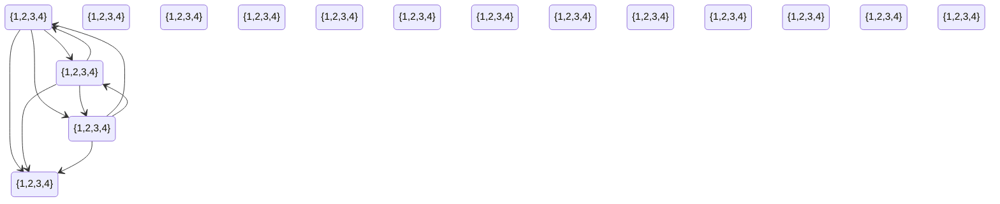

## Ex 1
remove 3 from A and 4 from b

## Ex 2
Variables
$V=v_{ij}=\{1\leq i,j\leq 9\}$
Domain
$\forall v \in V . v \in \{1,\dots,9\}$
Constraints

No it is not the way we would do soduko, but similar

## Ex 3
$V=\{a,b,c,d\}$
$v\in V : \{1,\dots,10\}$
Constraints
- $2|a-c|>3$
- $b^2-3d<9$
- $b+3<c$

|     | Todo | removed |     |     |
| --- | ---- | ------- | --- | --- |
|     |      |         |     |     |
