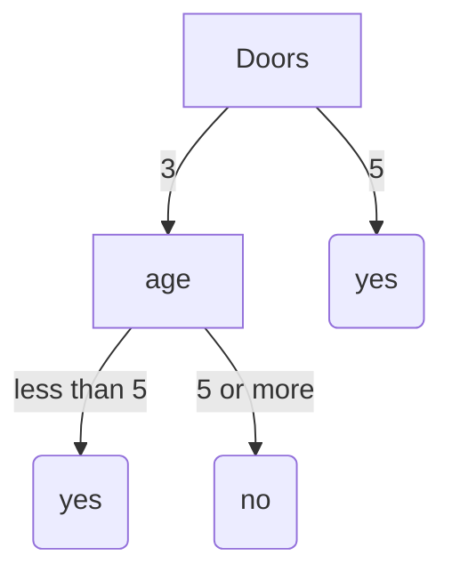

## Ex 1
![[Pasted image 20240919143019.png]]

```python
weights = [
    [0, 1, -1],
	[1,1,0]
]

x = [
	 [1,1],
	[0,0],
	[1,0],
	[2,1]
]

y = [2,0,3,2]

for w in weights:
	error = 0
	for i in range(4):
		xi = x[i]
		val = w[0] + w[1]*xi[0] + w[2]*xi[1]
		error += (y[i]-val)**2
	print(error)
```
i)
9/4

ii) 3/4

ii is better

## Ex 2
![[Pasted image 20240919144437.png]]
a)
$$h(p)=-\frac{2}{5}\cdot\log_{2} \frac{2}{5}-\frac{1}{5}\cdot\log_{2} \frac{1}{5}-\frac{2}{5}\cdot\log_{2} \frac{2}{5}=1.52$$

b)


c)

Starting entropy:
$$h(p)=-\frac{2}{5}\cdot\log_{2} \frac{2}{5}-\frac{3}{5}\cdot\log_{2} \frac{3}{5}=0.67$$
5 doors entropy: 0

3 doors entropy:
$$h(p)=-\frac{1}{3}\cdot\log_{2} \frac{1}{3}-\frac{2}{3}\cdot\log_{2} \frac{2}{3}=0.63$$
Expected entropy = $\frac{2}{5}*0+ \frac{3}{5}*0.63=0.38$
Information gain is 0.29

After age they are 0, so information gain is .38

## Ex 3
![[Pasted image 20240919150352.png]]
![[Pasted image 20240919150503.png]]
a)
The tree is simply a node \[false\] with sum of errors being 5
b)
Assuming error of 1 on individual indexes, $1^{2}\cdot5=5$
c)
Splitting on laywer gives an error of 3
d)
Same assumption as b gives 3
e)
Splitting on lawyer and then 

## Ex 4
![[Pasted image 20240919152606.png]]
a)
entropy form $$=0\cdot \frac{3}{10}+0\cdot 3/10+(- \frac{2}{4}\cdot\log_{2}(\frac{2}{4})-\frac{2}{4}\cdot\log_{2}(\frac{2}{4}))\cdot\frac{4}{10}=0+0+(0.5+0.5)\cdot\frac{4}{10}=4/10$$
## Ex 5
![[Pasted image 20240919152650.png]]
Fair dice:
$6\cdot(-\frac{1}{6}\cdot\log_{2}(\frac{1}{6}))=2.58$
Weighted dice:
$-\frac{1}{2}\cdot\log_{2}(\frac{1}{2})-\frac{1}{4}\cdot\log_{2}(\frac{1}{4})-4\cdot(\frac{1}{16}\cdot\log_{2}(\frac{1}{16}))=2$

## Ex 6
![[Pasted image 20240919154112.png]]
![[Pasted image 20240919154204.png]]
2. His tree could get very large not starting with pineapple, as it doesn