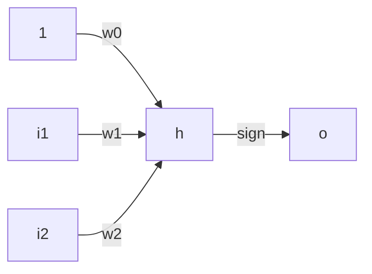

## Ex 1
![[Pasted image 20240923101833.png]]
Given that all inputs are binary and the output is also a single binary value, it should have a binary (0,1) input node for each input, and a single (0,1) output node

## Ex 2
![[Pasted image 20240923102006.png]]
![[Pasted image 20240923102024.png]]
For (1,5)
left $=\sigma(1.3\cdot1-0.3\cdot5)=\sigma(0.85)\approx0.6$
right $=\sigma(1.7\cdot1+1\cdot5)=\sigma(6.7)\approx1$
rating $=\sigma(0.6\cdot0.6-1.4\cdot1)=\sigma(-1.04)\approx-0.25$

For (1,5)
left $=\sigma(1.3\cdot0-0.3\cdot14)=\sigma(4)\approx1$
right $=\sigma(1.7\cdot0+1\cdot14)=\sigma(14)\approx1$
rating $=\sigma(0.6\cdot1-1.4\cdot1)=\sigma(-0.8)\approx-0.25$

## Ex 3
![[Pasted image 20240923103014.png]]

i)
Feedforward

| X1  | X2  | h   | o   | y   | SSE |
| --- | --- | --- | --- | --- | --- |
| 1   | 1   | 0   | -1  | 1   | 4   |
| -1  | 1   | 0   | -1  | -1  | 0   |
| 1   | -1  | 0   | -1  | 1   | 4   |
| -1  | -1  | 0   | -1  | -1  | 0   |
|     |     |     |     |     |     |
According to slide 28, for sign as activation, we ignore it when updating weights, as it is not meaningfully differentiable

$w_{ab}^{new}:=w_{ab}^{current}+\alpha\cdot(y-o_{b})\cdot x_{ab}$

$w_{i}:=w_{i}+\alpha\sum\limits_{j=1}^{M}(y_{j}-o_{j})\cdot x_{i,j}$

$w_{0}=0+0.25\cdot((1--1)\cdot1+(-1--1)\cdot1+(1--1)\cdot1+(-1--1)\cdot1)=0.25\cdot(2+0+2+0)=1$
$w_{1}=0+0.25\cdot((1--1)\cdot1+(-1--1)\cdot-1+(1--1)\cdot1+(-1--1)\cdot-1)=0.25\cdot(2+0+2+0)=1$
$w_{2}=0+0.25\cdot((1--1)\cdot1+(-1--1)\cdot1+(1--1)\cdot-1+(-1--1)\cdot-1)=0.25\cdot(2+0-2+0)=0$
And we go agane

| X0  | X1  | X2  | h                           | o   | y   | SSE |
| --- | --- | --- | --------------------------- | --- | --- | --- |
| 1   | 1   | 1   | $1\cdot1+1\cdot1+1\cdot0=2$ | 1   | 1   | 4   |
| 1   | -1  | 1   | 0                           | -1  | -1  | 0   |
| 1   | 1   | -1  | 2                           | 1   | 1   | 4   |
| 1   | -1  | -1  | 0                           | -1  | -1  | 0   |
Yayyyyyyy it's correct, the network is smart
Calculating gradiant descent results in an error of 0, so nothing changes

ii)
Using stochastic gradient descent:

| X0    | X1  | X2  | w0                            | w1                             | w2                            | h   | o   | y   |
| ----- | --- | --- | ----------------------------- | ------------------------------ | ----------------------------- | --- | --- | --- |
| 1     | 1   | 1   | 0                             | 0                              | 0                             | 0   | -1  | 1   |
| 1     | -1  | 1   | $0+0.25\cdot(1--1)\cdot1=0.5$ | $0+0.25\cdot(1--1)\cdot1=0.5$  | $0+0.25\cdot(1--1)\cdot1=0.5$ | 0.5 | 1   | -1  |
| 1     | 1   | -1  | $0.5+0.25\cdot(-1-1)\cdot1=0$ | $0.5+0.25\cdot(-1-1)\cdot-1=1$ | $0.5+0.25\cdot(-1-1)\cdot1=0$ | 1   | 1   | 1   |
| 1     | -1  | -1  | 0                             | 1                              | 0                             | -1  | -1  | -1  |
| Agane |     |     |                               |                                |                               |     |     |     |
| 1     | 1   | 1   | 0                             | 1                              | 0                             | 1   | 1   | 1   |
| 1     | -1  | 1   | 0                             | 1                              | 0                             | -1  | -1  | -1  |
| 1     | 1   | -1  | 0                             | 1                              | 0                             | 1   | 1   | 1   |
| 1     | -1  | -1  | 0                             | 1                              | 0                             | -1  | -1  | -1  |
## Ex 4
![[Pasted image 20240923111325.png]]
i)
Assume biases are not shown in the graphs
1. $(4+1)\cdot(5)+(5+1)\cdot(1)=31$
2. $(4+1)\cdot3=12$
3. $(4+1)\cdot5+(5+1)\cdot5+(5+1)\cdot5+(5+1)\cdot1=90$
ii)
Probably not the answer you are looking for, but given that each weight can hold an infinite amount of values, there are an infinite amount of functions the networks can represent
Assuming sign as activation function we are limited to boolean values, which means the answer is all combinations of inputs combined with all outputs for each of those inputs.
$functions=2^{inputnodes}\cdot2^{inputnodes^{outputnodes}}$
1. $2^{4}\cdot2^{4^{1}}=65536$
iii)
From the slides we have xor as
![[Pasted image 20240923113431.png]]
So given the universal approximation theorem, the second network cannot, as it has no hidden layers, but the other two can, as they are simply larger than the example network. Setting some weights to 0 then results in the network from the slides.

## Ex 5
![[Pasted image 20240923113616.png]]
![[Pasted image 20240923113626.png]]
